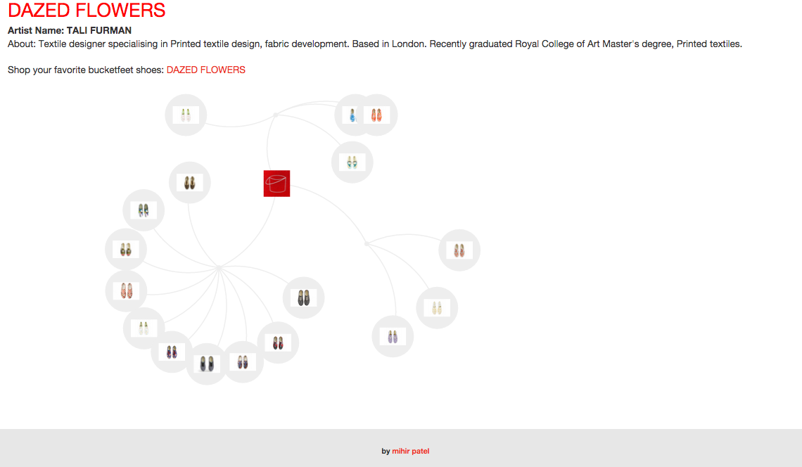

##Visualzing artist inspired shoes through D3.js

Bucketfeet has several artists at times. It makes it hard for users to find a specific artist or interact with them in a fun way. With D3.js force layout, it allows users to explore shoes, learn more about artist and link each artist to Bucketfeet e-commerce website.

**Built on:**
- HTML5
- CSS
- Javascript
- D3.JS Library

###Steps to follow to run the app:
- Clone the repo
- Run http-server on your local terminal
- Open up your browser and type "localhost:8080" in the address bar

###Features:
- Zoom in on shoes
- Artist grouped in their respective countries
- Click on your favorite shoe, it will give you more information on the artist and a link to shop those shoes on bucketfeet website

